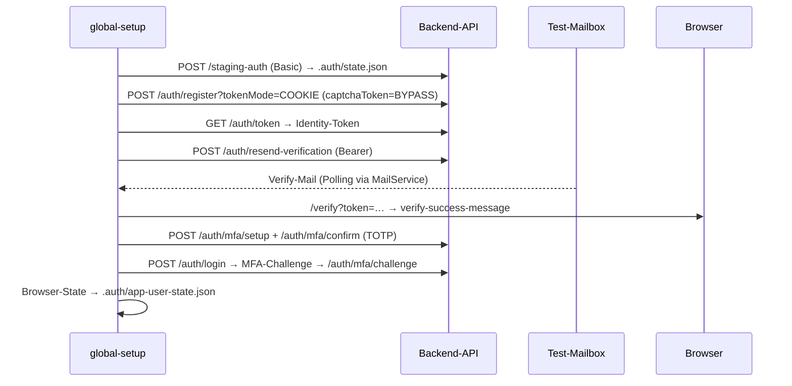

# Test-Architektur

Wie die Systemtests aufgebaut sind und wie der Test-User-Lebenszyklus funktioniert.
Für Commands und Konventionen siehe [CLAUDE.md](../CLAUDE.md) bzw. [README.md](../README.md).

## Schichten

```
tests/specs/      Testfälle — Given/When/Then via test.step(), keine Selektoren, keine rohen API-Calls
tests/pages/      Page Objects (Selektoren + UI-Aktionen), gruppiert nach Feature-Bereich
tests/fixtures/   Custom test/expect + Skip-Guards (runsOnlyWithEnv, runsOnlyAgainstStaging)
tests/helpers/    API-Flows, Mail-Service, Captcha-Bypass, Cleanup, Konstanten
```

Regeln, die die Schichten sauber halten:

- Specs rufen **nie** Auth-Endpunkte inline auf — dafür gibt es `helpers/auth-api.ts`
  (`registerTestUserViaApi`, `verifyUserViaMailLink`, `setupMfaViaApi`, `loginWithMfaViaApi`, …).
- `BASE_URL` wird **nur** in `helpers/constants.ts` ausgewertet (`resolveBaseURL()`).
  `page.request` und `page.goto` nehmen relative Pfade, die gegen `use.baseURL` aufgelöst werden.
- Magic Strings (Mail-Betreffe, Captcha-Token, Timeouts) leben in `helpers/constants.ts`.

## Test-User-Lebenszyklus (global-setup)

Der Standard-Lauf legt pro Run einen frischen App-Testuser an. Wichtigste Stolperfalle:
**die Registrierung verschickt selbst keine Mail** — erst `resend-verification` löst die
Verify-Mail aus (Backend: `UserVerificationService.issueVerificationToken`).



Specs nutzen den User über die Fixtures `authenticatedPage` / `appTestUser`.
Im `globalTeardown` wird der User (plus alle von Specs registrierten User) wieder gelöscht.

## Captcha-Bypass

Das Register-/Login-Formular nutzt Cloudflare Turnstile, das headless nie löst. Der Bypass
hat zwei Hälften (beide in `helpers/captcha.ts` + `helpers/constants.ts`):

1. **Backend:** `CAPTCHA_BYPASS`-Cookie + `captchaToken: 'BYPASS'` → CaptchaService akzeptiert.
2. **Frontend:** Turnstile-Script wird per Route-Stub ersetzt, liefert sofort das Bypass-Token
   (sonst bliebe der Submit-Button disabled).

## State-Dateien in `.auth/`

| Datei | Inhalt | Geschrieben von |
|-------|--------|-----------------|
| `state.json` | Staging-Barrier-Cookie (leer bei lokalem Lauf) | `setupStagingBarrier` (global-setup) |
| `test-user.json` | App-Testuser-Datensatz inkl. MFA-Secret (`status: ready/failed/skipped`) | global-setup |
| `app-user-state.json` | Eingeloggter Browser-State (Cookies nach Login + MFA) | global-setup |
| `cleanup-users.json` | Queue aller registrierten Test-User → gelöscht im Teardown | `recordCleanupUser` |
| `cleanup-failures.json` | Permanente Cleanup-Fehler (nach 3 Retries) | Teardown/Pre-Run |

`state.json` bleibt liegen; `test-user.json` und `app-user-state.json` werden im Teardown gelöscht.

## Env-Flags & Skip-Verhalten

Es gibt **keine Opt-in-Flags (`RUN_*`) mehr** (Juli 2026 entfernt): `test:staging` führt
alle Specs aus. Specs überspringen sich nur noch aus zwei echten Gründen:

- `runsOnlyAgainstStaging(...)` — Spec braucht Staging-Infrastruktur (Route53,
  Mail-Pipeline, Stripe-Sandbox, OAuth-/Turnstile-Konfiguration). Lokal (`npm test`)
  werden diese Specs übersprungen.
- `runsOnlyWithEnv(...)` — nötiger API-Key fehlt (`MAIL_SERVICE_API_KEY`,
  `ADMIN_PORTAL_API_KEY`).

Gegen Staging mit vollständiger `.env.local` gibt es also **0 Skips**.

| Flag | Wirkung |
|------|---------|
| `SKIP_APP_TEST_USER_SETUP=1` | Kein App-Testuser (für Suiten ohne Login, z.B. admin/external) |
| `SKIP_CROSSRUN_CLEANUP=1` | Monitor-Runner: teurer Orphan-Scan läuft zentral 1× statt pro Suite |
| `USE_FIXTURE_USER=1` | Vorprovisionierter User aus `FIXTURE_USER_*`-Secrets statt frischer Registrierung |
| `HEADED_SETUP=1` / `SLOW_MO_MS` | Global-Setup-Browser sichtbar/verlangsamt |

Die vollständige Env-Var-Tabelle (Credentials, Timeouts) steht in [CLAUDE.md](../CLAUDE.md).

## Echte DNS-Verifikation (Domain-CRUD)

`domain-crud.spec.ts` prüft nicht nur den App-State, sondern auch, dass der A-Record
**wirklich** in Route53 landet: `helpers/dns.ts` ermittelt die autoritativen Nameserver
der Zone (NS-Lookup, Labels von links abschneidend) und fragt sie direkt ab — Public
Resolver würden (negativ) cachen und die Checks flaky machen. Geprüft wird Create
(Record = Ziel-IP), Update (Record = neue IP) und Delete (Record weg), jeweils per
Polling mit 2-Minuten-Budget. Die FQDN kommt per `helpers/subdomain-api.ts` aus
`GET /api/v1/subdomain/{uuid}`.

## Monitor-Suiten (nightly)

`scripts/monitor.ts` partitioniert die Specs überlappungsfrei **per Spec-Datei-Liste**
in den `test:staging:*`-Scripts (package.json): `default` = `test:staging:core`,
daneben `mail`, `mfa-ui`, `stripe`, `admin`, `external`. **Jede neue Spec-Datei muss in
genau einem dieser Scripts auftauchen** (Core oder eine eigene Suite), sonst fehlt sie
im nightly Monitor. Details: [grafana-systemtest.md](grafana-systemtest.md).

## Given/When/Then-Konvention

Flow-Tests strukturieren ihre Phasen mit `test.step('Given: …' / 'When: …' / 'Then: …')` —
die Steps erscheinen im HTML-Report und im Trace-Viewer als aufklappbare Blöcke.
Setup-Ergebnisse werden aus dem Step returned (`const user = await test.step(…)`).
Triviale Ein-Assertion-Tests (smoke, static-pages) brauchen keine Steps.
